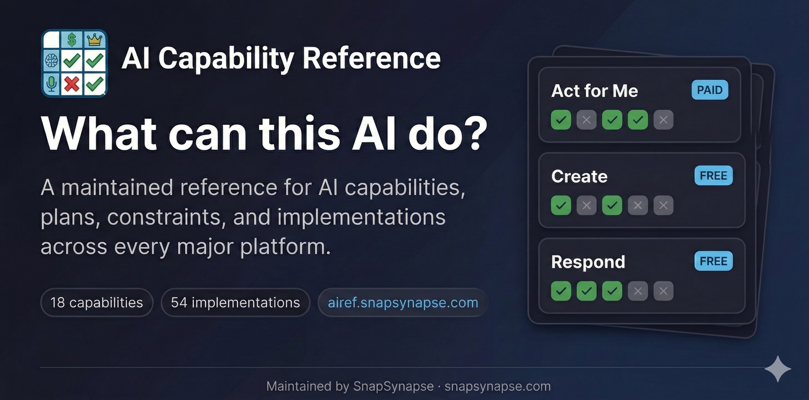

# AI Capability Reference

**Previously known as "AI Feature Tracker."** Renamed to "AI Capability Reference" in February 2026 to better reflect the project's ontology-first, capability-centric approach.

**Plain-English reference for AI capabilities, plans, constraints, and implementations.**



---

## What is this?

A single source of truth for answering questions like:
- "Is ChatGPT Agent Mode available on the $8/mo plan?" (No, Plus or higher)
- "Can I use Claude Cowork on Windows?" (Not yet, macOS only)
- "Which open/self-hosted models can I realistically run on my hardware?" (Depends on VRAM)

Built for fellow AI facilitators, educators, designers, and anyone who needs accurate, current information about AI tool availability.

## Scope

This reference covers:

- major consumer-facing AI products with meaningful public usage or visibility
- commercially available AI systems that ordinary people can sign up for and use
- important self-hosted/open model families and runtimes that people can realistically run or choose locally

This reference does not aim to catalog every enterprise AI vendor, infrastructure platform, or niche model release.

The `~1% market share` idea is used here as a practical inclusion heuristic, not a strict ontology field, because public usage data is inconsistent and is usually measured at the product level rather than the model level.

## Platforms Covered

| Platform | Vendor | Features Tracked |
|----------|--------|------------------|
| **ChatGPT** | OpenAI | Agent Mode, Canvas, Voice, Sora, DALL-E, Search, Deep Research, Codex, Custom GPTs |
| **Claude** | Anthropic | Code, Cowork, MCP, Connectors, Projects, Artifacts, Extended Thinking, Vision |
| **Copilot** | Microsoft | Office Integration, Designer, Vision, Voice, Agent Builder |
| **Gemini** | Google | Advanced, NotebookLM, AI Studio, Deep Research, Gems, Workspace, Imagen, Veo, Live, Project Astra |
| **Perplexity** | Perplexity AI | Comet Browser, Agent Mode, Pro Search, Focus, Collections, Voice |
| **Grok** | xAI | Chat, Aurora (images), DeepSearch, Think Mode, Voice |
| **Meta** | Meta | Llama 3.3, Llama 4 |
| **Mistral** | Mistral | Codestral, Mistral Large/Nemo, Mistral Small 3 |
| **DeepSeek** | DeepSeek | DeepSeek V3 / R1 |
| **Alibaba** | Alibaba | Qwen 2.5, Qwen 3, Qwen 3.5, Qwen-Coder |
| **Ollama** | Ollama | Self-hosted runtime product |
| **LM Studio** | LM Studio | Self-hosted runtime product |

## Features

- **Plan-by-plan availability** — See exactly which tier unlocks each feature
- **Capability-first view** — Browse plain-English capabilities in addition to the feature view
- **Platform support** — Windows, macOS, Linux, iOS, Android, web, terminal, API
- **Talking points** — Ready-to-use sentences for presentations (click to copy)
- **Category filtering** — Voice, Coding, Research, Agents, and more
- **Price tier filtering** — Find features at your budget
- **Provider toggles** — Focus on specific platforms
- **Dark/light mode** — Toggle for your preference
- **Permalinks** — Link directly to any feature with shareable URLs
- **Shareable URLs** — Filter state preserved in URL parameters
- **Maintainer-led** — Managed by SnapSynapse; public issues and PRs welcome

## Accessibility

This site is designed to meet WCAG 2.1 AA standards:

- **Keyboard navigation** — Full keyboard support with ↑/↓/j/k to navigate cards, Enter to copy, Tab to move between interactive elements
- **Skip link** — "Skip to main content" link for screen reader users (visible on focus)
- **Focus indicators** — Clear 2px accent-colored outlines on all interactive elements
- **Color contrast** — Minimum 4.5:1 contrast ratio for all text in both light and dark modes
- **Reduced motion** — Animations and transitions disabled when `prefers-reduced-motion` is enabled
- **Touch targets** — Minimum 44px touch targets on mobile for easier tapping
- **ARIA attributes** — Live regions announce filter count changes, decorative images marked with `aria-hidden`
- **Semantic HTML** — Proper heading hierarchy, landmark regions, and button/link semantics

If you're interested in accessibility tooling, check out [skill-a11y-audit](https://github.com/snapsynapse/skill-a11y-audit) — a companion project that automates WCAG audits as a reusable AI skill. If you like what you see here, you'll love that.

## Update Cycle

Data in this reference is kept current through a semi-automated process combining scheduled AI verification with human review.

**How it works:**

Every Sunday, a four-model cascade queries Gemini, Perplexity, Grok, and Claude to cross-check all tracked features — pricing tiers, platform availability, status, gating, and regional restrictions. To prevent provider bias, models are skipped when verifying features from their own platform (e.g. Gemini is not asked about Google features). A change is only flagged when at least three models agree on a discrepancy. Confirmed changes are surfaced as GitHub issues or pull requests for human review — nothing is auto-merged.

Link integrity is checked separately every Wednesday, catching broken or redirected source URLs across all platforms.

Features are also marked with a `Checked` date. Anything not re-verified within 30 days is treated as stale and prioritised in the next run.

## How to Contribute

Found outdated info? Want to add a feature? See [CONTRIBUTING.md](CONTRIBUTING.md).

Quick version:
1. Edit the relevant record in `data/platforms/`, `data/model-access/`, `data/products/`, or `data/implementations/`
2. Include or preserve the evidence source link
3. Run `node scripts/sync-evidence.js`
4. Run `node scripts/validate-ontology.js`
5. Submit a PR

## Automated Verification

This project includes an automated feature verification system that uses multiple AI models to cross-reference all feature data.

### What gets verified

- **Pricing tiers** — Which subscription plans have access
- **Platform availability** — Windows, macOS, Linux, iOS, Android, web, terminal, API
- **Status** — GA, Beta, Preview, Deprecated
- **Gating** — Free, Paid, Invite-only, Org-only
- **Regional availability** — Global vs region-restricted features
- **URLs** — Feature page links are valid and accessible

### How it works

1. **Multi-model cascade** — Queries Gemini, Perplexity, Grok (X/Twitter), and Claude
2. **Bias prevention** — Skips same-provider models (e.g., won't ask Gemini about Google features)
3. **Consensus required** — Needs 3 models to confirm a change before flagging
4. **Auto-changelog** — Confirmed changes are logged to each feature's changelog
5. **Human review** — Creates issues/PRs for review, never auto-merges

### Running verification

```bash
# Verify all features
node scripts/verify-features.js

# Verify a specific platform
node scripts/verify-features.js --platform claude

# Check only stale features (>30 days since last check)
node scripts/verify-features.js --stale-only

# Dry run (no issues created)
node scripts/verify-features.js --dry-run
```

### Link checking

Two link checkers serve different purposes:

**CI checker** (`check-links.js`) — runs in GitHub Actions weekly. Uses canonical categories from the collaboration protocol:
- `ok`
- `broken`
- `soft-blocked` (e.g., persistent 403/bot protection; informational)
- `rate-limited` (429; informational)
- `timeout`
- `needs-manual-review`

The checker fails CI on actionable problems (`broken`, `timeout`) while keeping soft-blocked/rate-limited as non-actionable signals.

```bash
node scripts/check-links.js              # Check all links
node scripts/check-links.js --broken-only # Show only broken links
```

**Browser checker** (`check-links-browser.js`) — runs locally through a real Chrome browser via [Chrome DevTools Protocol](https://chromedevtools.github.io/devtools-protocol/). Bypasses all bot protection, captures page titles for content verification, and shows redirects. Zero external dependencies.

```bash
# Terminal 1: Start Chrome with remote debugging
# (--user-data-dir avoids conflicts with your normal browser session)

# macOS (Chrome)
/Applications/Google\ Chrome.app/Contents/MacOS/Google\ Chrome \
  --remote-debugging-port=9222 --user-data-dir=/tmp/chrome-link-check

# macOS (Brave, Edge, or any Chromium browser also works)

# Linux
google-chrome --remote-debugging-port=9222 --user-data-dir=/tmp/chrome-link-check

# Terminal 2: Run the checker
node scripts/check-links-browser.js                # All platforms
node scripts/check-links-browser.js -p claude       # One platform
node scripts/check-links-browser.js --help          # All options
```

Requires API keys (verification only): `GEMINI_API_KEY`, `PERPLEXITY_API_KEY`, `XAI_API_KEY`, `ANTHROPIC_API_KEY`

See [VERIFICATION.md](VERIFICATION.md) for full documentation.

## Local Development

```bash
# Clone the repo
git clone https://github.com/snapsynapse/ai-capability-reference.git
cd ai-capability-reference

# Build the dashboard
node scripts/build.js

# Sync ontology-native evidence records
node scripts/sync-evidence.js

# Validate ontology records
node scripts/validate-ontology.js

# Open it
open docs/index.html
```

Archived platform bundles live under `data/archive/platforms/` for historical reference, and `node scripts/build.js` reads only active evidence from `data/platforms/`.
Ontology-native evidence records live in `data/evidence/index.json` and are seeded with `node scripts/sync-evidence.js`.

## Skills

Canonical cross-platform skill sources live under [skills](skills/).

Build platform exports with:

```bash
node scripts/build-skill-bundles.js
```

That generates Perplexity, Claude, and Codex-ready outputs under each skill's local `dist/` directory without turning the repo itself into a pile of hand-maintained exports.

## Data Format

Platform data is stored in simple markdown files. Example:

```markdown
## Feature Name

| Property | Value |
|----------|-------|
| Category | agent |
| Status | ga |

### Availability

| Plan | Available | Limits | Notes |
|------|-----------|--------|-------|
| Free | ❌ | — | Not available |
| Plus | ✅ | 40/month | Message limit |

### Talking Point

> "Your presenter-ready sentence with **key details bolded**."

### Sources

- [Official docs](https://example.com)
```

See [data/_schema.md](data/_schema.md) for the full specification.

## Deployment

The site auto-deploys via GitHub Actions when changes are pushed to `main`.

### How it works

1. **Build job** (`.github/workflows/build.yml`)
   - Runs `node scripts/build.js` to regenerate all pages under `docs/`
   - If output changed, commits it back to `main` with `[skip ci]` to prevent loops
   - Runs on both pushes and PRs (PRs only validate the build, no commit)

2. **Deploy job** (same workflow)
   - Uploads `docs/` folder to GitHub Pages
   - Only runs on pushes to `main`, not PRs

3. **FTP deploy** (`.github/workflows/deploy-ftp.yml`)
   - Parallel deployment to snapsynapse.com via locked ftp
   - Requires `FTP_HOST`, `FTP_USER`, `FTP_PASS` secrets

### GitHub Pages setup

To enable GitHub Pages on a fork:

1. Go to **Settings → Pages**
2. Under "Build and deployment", select **GitHub Actions**
3. The workflow will deploy to `https://<username>.github.io/ai-capability-reference/`

### Manual build

```bash
node scripts/build.js
```

Output files:
- `docs/index.html` — Capability homepage
- `docs/implementations.html` — Detailed Availability (implementation matrix)
- `docs/constraints.html` — Access & Limits (constraint view)
- `docs/capabilities.html` — Redirect stub (backward compat)
- `docs/about.html` — About page (generated from README.md)

## License

MIT - see [LICENSE](LICENSE)

## Credits

Created by [SnapSynapse](https://snapsynapse.com) for the AI training community.
With help from Claude Code, of course.

---

**Found an error?** [Open an issue](https://github.com/snapsynapse/ai-capability-reference/issues) or submit a PR!
