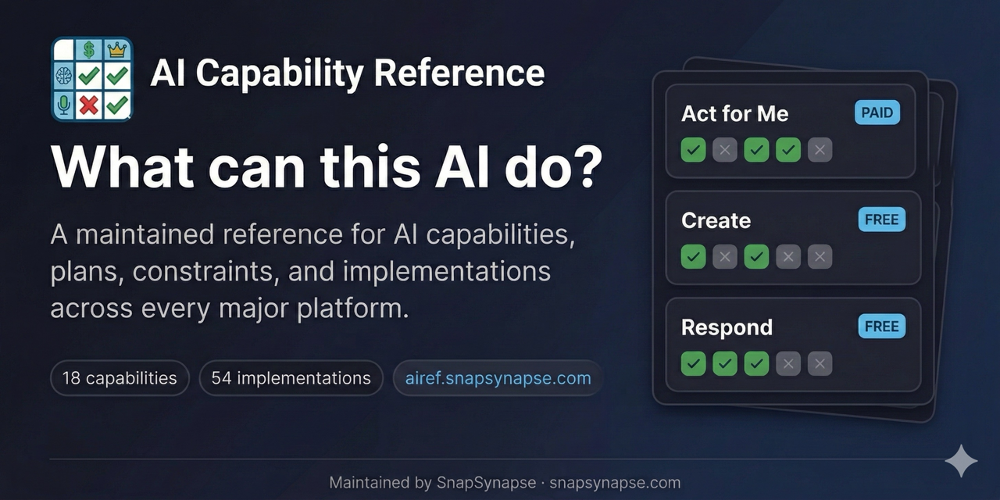

[](https://github.com/snapsynapse/ai-tool-watch/blob/main/LICENSE)
[](https://github.com/snapsynapse/ai-tool-watch/releases/latest)
# AI Tool Watch

**Plain-English reference for AI capabilities, plans, constraints, and implementations — for humans and agents.**



---

## Who this is for

Anyone — humans or agents — who needs current, plain-English answers about AI tool capabilities, plan gates, and constraints before committing to a tool.

## What problem it solves

AI tool capabilities, plan limits, and constraints change constantly and are scattered across marketing pages. AI Tool Watch is a single, verified, plain-English reference for humans and agents.

## Canonical URL

https://aitool.watch/

## What is this?

A single source of truth for answering questions like:
- "Is ChatGPT Agent Mode available on the $8/mo plan?" (No, Plus or higher)
- "Can I use Claude Cowork on Windows?" (Yes, macOS and Windows x64)
- "Which open/self-hosted models can I realistically run on my hardware?" (Depends on VRAM)

Built for AI facilitators, educators, developers, and AI agents that need accurate, current information about AI tool availability. Browse the site, query the JSON API, or connect an agent via MCP.

## How it's built

There is no database, no framework, and no dependencies. Every piece of data lives in plain markdown and YAML files under `data/`. A single zero-dependency Node.js script (`scripts/build.js`) reads those files and generates the entire site — HTML pages, JSON API, bridge pages, sitemap — into `docs/`.

That's the whole stack: markdown files, one build script, and Git.

Contributing doesn't require a dev environment. You edit a `.md` or `.yml` file, open a PR, and CI rebuilds the site. If you can read a markdown table, you can read (and fix) the data. See [design/ARCHITECTURE_PATTERNS.md](design/ARCHITECTURE_PATTERNS.md) for the full architectural rationale.

## What's covered

18 capabilities, 87 implementations, and 9 open-model access records across major consumer AI products and self-hosted runtimes.

All prices are in **USD**. Availability reflects the **United States** region by default.

| Product | Provider | Type |
|---|---|---|
| **ChatGPT** | OpenAI | Hosted |
| **Claude** | Anthropic | Hosted |
| **Copilot** | Microsoft | Hosted |
| **Gemini** | Google | Hosted |
| **Perplexity** | Perplexity AI | Hosted |
| **Grok** | xAI | Hosted |
| **Meta (Llama)** | Meta | Open model |
| **Mistral** | Mistral | Open model |
| **DeepSeek** | DeepSeek | Open model |
| **Alibaba (Qwen)** | Alibaba | Open model |
| **Ollama** | Ollama | Runtime |
| **LM Studio** | LM Studio | Runtime |

Scope criteria and watchlist: [design/SCOPE.md](design/SCOPE.md), [design/WATCHLIST.md](design/WATCHLIST.md).

## Features

### Site

- **Capability-first view** — Browse plain-English capabilities as the primary entry point
- **Plan-by-plan availability** — See exactly which tier unlocks each implementation
- **Platform support** — Windows, macOS, Linux, iOS, Android, web, terminal, API
- **Talking points** — Ready-to-use sentences for presentations (click to copy)
- **Filtering** — By category, price tier, and provider
- **Shareable URLs** — Filter state and feature permalinks preserved in URL parameters
- **Dark/light mode** — Toggle for your preference
- **125 bridge pages** — Programmatic `/can/`, `/compare/`, `/capability/`, and `/best-for/` pages with schema.org structured data

### API and agents

- **JSON API** — 10 stable files at `docs/api/v1/` covering all entity types and derived views ([usage guide](docs/api/v1/USAGE.md))
- **MCP server** — 15 read-only tools via `scripts/mcp-server.js` for agent-queryable access (config: `mcp.json`). Dual-era: speaks MCP spec 2026-07-28 (stateless, `server/discover`, cacheable tool lists) and legacy 2024-11-05 in the same process. Error responses follow the [Graceful Boundaries](https://github.com/snapsynapse/graceful-boundaries) pattern with structured refusal and constructive guidance.

### Automation

- **Multi-model verification** — Twice-weekly four-model cascade cross-checks all data with human review gate
- **Link integrity** — Weekly URL validation across all evidence sources
- **Staleness tracking** — Features not re-verified within 7 days are flagged for the next run

## Accessibility

This site is designed to meet WCAG 2.1 AA standards:

- **Keyboard navigation** — Full keyboard support with ↑/↓/j/k to navigate cards, Enter to copy, Tab to move between interactive elements
- **Skip link** — "Skip to main content" link for screen reader users (visible on focus)
- **Focus indicators** — Clear 2px accent-colored outlines on all interactive elements
- **Color contrast** — Minimum 4.5:1 contrast ratio for all text in both light and dark modes
- **Reduced motion** — Animations and transitions disabled when `prefers-reduced-motion` is enabled
- **Touch targets** — Minimum 44px touch targets on mobile for easier tapping
- **ARIA attributes** — Live regions announce filter count changes, decorative images marked with `aria-hidden`
- **Semantic HTML** — Proper heading hierarchy, landmark regions, and button/link semantics

See also: [skill-a11y-audit](https://github.com/snapsynapse/skill-a11y-audit), a companion project that automates WCAG audits as a reusable AI skill.

## How data stays current

Twice a week, a four-model cascade queries Gemini, Perplexity, Grok, and Claude to cross-check all tracked features. Models are skipped when verifying their own vendor's products. A change is only flagged when at least three models agree. Nothing is auto-merged — confirmed changes are surfaced as GitHub issues for human review.

Link integrity is checked every Saturday. Features carry a `Checked` date; anything older than 7 days is prioritized in the next run.

See [VERIFICATION.md](VERIFICATION.md) for full documentation, commands, and API key setup.

## Contributing

Found outdated info? Want to add a feature? See [CONTRIBUTING.md](CONTRIBUTING.md).

Quick version:
1. Edit the relevant record in `data/platforms/`, `data/model-access/`, `data/products/`, or `data/implementations/`
2. Include or preserve the evidence source link
3. Run `node scripts/sync-evidence.js`
4. Run `node scripts/validate-ontology.js`
5. Submit a PR

## Local development

```bash
git clone https://github.com/snapsynapse/ai-tool-watch.git
cd ai-tool-watch

node scripts/build.js               # Build the site
node scripts/sync-evidence.js       # Sync evidence records
node scripts/validate-ontology.js   # Validate cross-record integrity

open docs/index.html
```

Build output:
- `docs/index.html` — Capability homepage
- `docs/implementations.html` — Detailed availability matrix
- `docs/constraints.html` — Access & limits
- `docs/compare.html` — Side-by-side product comparison
- `docs/about.html` — About page
- `docs/api/v1/*.json` — Machine-readable JSON API (10 files)
- `docs/can/*/`, `docs/compare/*/`, `docs/capability/*/`, `docs/best-for/*/` — 125 bridge pages
- `docs/sitemap.xml` — Dynamic sitemap (132 URLs)

Data format: [data/_schema.md](data/_schema.md). Ontology schema: [design/SCHEMA_PROPOSAL.md](design/SCHEMA_PROPOSAL.md).

## Deployment

The site prepares and deploys one reviewed artifact on every push to `main` and on its Monday/Thursday scheduled run. Pull requests validate the source tree and prepare the artifact but do not deploy it.

### How it works

1. **Validate and prepare jobs** (`.github/workflows/build.yml`)
   - Validates the committed source/evidence tree, then runs `node scripts/prepare-publication.js`
   - Synchronizes canonical evidence, generates `docs/`, validates the generated site and a human/API/MCP fixture, and writes `docs/publication-manifest.json`
   - If the scheduled or push run changes canonical inputs or generated output, commits the scoped source and `docs/` paths with `[skip ci]`
   - Uploads the resulting `reviewed-publication` artifact, including hidden files

2. **Deploy job** (same workflow)
   - Downloads and verifies the reviewed artifact in a fresh directory before uploading it to GitHub Pages
   - Runs on pushes to `main` and scheduled builds, not PRs

3. **FTP deploy** (`.github/workflows/deploy-ftp.yml`)
   - Reuses the same reviewed artifact, verifies it in a fresh directory, then deploys it to https://aitool.watch/ via FTP
   - Runs in parallel with the GitHub Pages deployment on push-to-main and scheduled runs
   - Requires `FTP_HOST`, `FTP_USER`, `FTP_PASS` secrets

The artifact boundary is local and CI evidence only. It does not establish a hosted deployment, direct-email delivery, or independent missed-run monitoring.

### GitHub Pages setup

To enable GitHub Pages on a fork:

1. Go to **Settings → Pages**
2. Under "Build and deployment", select **GitHub Actions**
3. The workflow will deploy to `https://<username>.github.io/ai-tool-watch/`

## Design documentation

Architecture, ontology, and project status docs live in [design/](design/):

- [Knowledge as Code](https://aitool.watch/pattern.html) — The development pattern behind this project ([research](design/PATTERN_RESEARCH.md))
- [ARCHITECTURE_PATTERNS.md](design/ARCHITECTURE_PATTERNS.md) — The nine patterns that compose the system
- [ONTOLOGY.md](design/ONTOLOGY.md) — Core entity types and relationships
- [ACCESS_LAYERS.md](design/ACCESS_LAYERS.md) — SEO, JSON API, and MCP layer design
- [ROADMAP.md](design/ROADMAP.md) — Current project status and outstanding work
- [WHY_THIS_EXISTS.md](design/WHY_THIS_EXISTS.md) — The problem this project was built to solve
- [Graceful Boundaries](https://github.com/snapsynapse/graceful-boundaries) — Specification for structured refusal and constructive guidance, applied to the MCP server's error responses

Skills: [skills/](skills/) ([README](skills/README.md))

## Sponsor

AI Tool Watch is free and open. If you rely on this reference, consider [sponsoring its upkeep](https://github.com/sponsors/snapsynapse) to keep the verification pipeline running. See [SPONSORS.md](SPONSORS.md).

## Stewardship and use

AI Tool Watch is an open reference under [Snap Synapse LLC](https://snapsynapse.com/) stewardship, authored by [Sam Rogers](https://linkedin.com/in/samrogers). It is used indirectly by [PAICE.work](https://paice.work/).

A planned integration will expose AI Tool Watch via MCP to PAICE so behavioral-reliability assessments stay current with product changes and PAICE Pro features. The reference remains MIT-licensed and free for any use.

## License

MIT - see [LICENSE](LICENSE)

## Credits

Created for [PAICE.work](https://paice.work) and the larger AI community.
With help from Claude Code, of course.

---

**Found an error?** [Open an issue](https://github.com/snapsynapse/ai-tool-watch/issues) or submit a PR!
